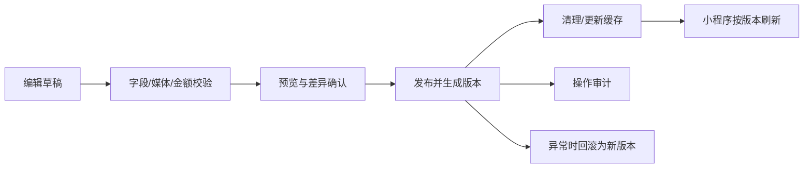
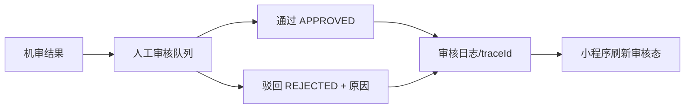

# 星球出机后台管理网站需求文档

## 1. 文档信息

| 项 | 内容 |
| --- | --- |
| 版本 | V1.0（需求设计基线） |
| 日期 | 2026-05-24 |
| 目标产品 | 桌面浏览器访问的后台管理网站 |
| 管理对象 | 微信小程序所呈现的商品、运营内容、交易与运营数据，以及报修运维业务 |
| 契约基线 | `docs/api/openapi/openapi.yaml` 为最终 Schema 真源；目前后台接口待补齐 |

## 2. 背景与目标

小程序已规划商品货架、商品详情、下单支付、会员钱包、托管资产、社区、分销、埋点和报修巡检等能力。运营人员需要通过后台维护小程序展示内容、处理需人工介入的业务，并查询经营与运维数据。

本后台的目标是：

1. 让运营人员可安全维护商品、场景专题和小程序运营配置，并按版本发布。
2. 为订单、用户、内容审核、资金及运维工单提供可追溯的管理视图和受控操作。
3. 基于埋点和业务数据提供经营分析与运维驾驶舱。
4. 将高权限写操作纳入角色权限、二次确认和审计，不允许后台成为绕过业务规则的直改工具。

## 3. 范围与约束

### 3.1 一期范围

| 业务域 | 一期范围 | 来源依据 |
| --- | --- | --- |
| 商品信息 | SKU、媒体、规格、租/买/软件价格、上下架、场景关联 | `FE-02/03`、`BE-02`、`API-02` |
| 活动与展示运营 | 场景专题、首页展示内容、话题、星球卡展示、QA/托管定价文案、版本生效 | `FE-01/02/09`、`BE-11`、`API-01` |
| 内容运营 | 帖子审核队列、人审通过/驳回及原因留痕 | `FE-09`、`BE-09`、`API-05` |
| 交易运营 | 订单查询、状态/事件明细、支付及合同查看、异常跟踪 | `FE-04/05`、`BE-03/04/05`、`API-03` |
| 用户与权益 | 用户查询、会员与资产摘要、账号状态受控管理 | `FE-06/08`、`BE-01/06/08`、`API-04` |
| 资金与分销 | 钱包/提现/佣金/结算批次查询和审核工作台，不直接改余额 | `FE-07/11`、`BE-07/10`、`API-04/06` |
| 数据分析 | 访问与转化、商品交易、内容审核、分销、报修巡检指标 | `FE-12`、`BE-13`、`API-06/07` |
| 报修运维 | 设备、工单、巡检计划/任务、反馈、知识文章、运维驾驶舱 | `FE-13`、`BE-13`、`API-07` |
| 系统管理 | 管理员登录、角色权限、操作审计、发布记录 | 安全与运维必需能力 |

### 3.2 活动信息的一期定义

现有需求没有独立的“营销活动/优惠券/秒杀/报名”领域。为避免生成未经确认的资金和计价规则，一期将活动信息限定为配置驱动的运营展示内容：

- 场景专题：年会、展会、门店、工业巡检、科研教育等场景信息及关联 SKU。
- 内容运营位：Banner/卡片、话题、推荐文案、QA、星球卡入口、托管定价说明。
- 发布能力：草稿、预览、定时生效、版本回滚、下线和变更审计。

若后续需要优惠券、满减、秒杀库存、报名或营销归因结算，应新增独立 `Campaign/Promotion` 领域、计价规则和 OpenAPI 契约后再实施。

### 3.3 非目标

- 后台不替代微信支付、COS 或腾讯云内容安全服务。
- 后台不允许手工覆盖后端试算金额、支付结果、钱包余额、佣金流水或订单状态机规则。
- 本文档不声明任何尚未写入 OpenAPI 的管理接口已可用。

## 4. 用户角色与权限

### 4.1 角色

| 角色 | 职责 | 数据范围 |
| --- | --- | --- |
| 超级管理员 `SUPER_ADMIN` | 管理员、权限、系统配置与全量审计 | 全域 |
| 运营管理员 `OPERATOR` | 商品、运营内容、活动承载配置、消息发布 | 授权业务域 |
| 内容审核员 `MODERATOR` | 社区帖子/素材审核与申诉处理 | 内容域 |
| 财务结算员 `FINANCE` | 支付、提现、分销结算和对账查看/审核 | 资金域，敏感信息脱敏 |
| 客服/履约人员 `SUPPORT` | 订单、用户、合同、工单查询和处置协作 | 授权订单/区域 |
| 运维管理员 `MAINTENANCE_ADMIN` | 设备、报修、巡检、反馈与运维报表 | 指定区域或全域 |
| 只读分析员 `ANALYST` | 指标看板与经授权导出 | 汇总数据 |

### 4.2 权限原则

- 权限粒度为“资源 + 动作 + 数据范围”，例如 `catalog.sku.publish:all`、`repair.workOrder.assign:region-east`。
- 配置发布、商品上下架、内容驳回、账号冻结、提现审核、数据导出为审计动作。
- 角色与权限变更必须由更高权限管理员操作，记录修改前后值；操作者不得修改自身权限以提升权限。
- 资金明细、openid、手机号或支付标识等敏感字段按角色脱敏展示与导出。

## 5. 信息架构与导航

| 一级菜单 | 二级功能 | 目标角色 |
| --- | --- | --- |
| 工作台 | 经营概览、待办、异常告警、快捷入口 | 所有授权后台用户 |
| 商品信息 | SKU 列表、详情编辑、价格/媒体、场景组合、上下架 | OPERATOR |
| 活动与运营 | 运营位、场景专题、话题与 QA、星球卡展示、配置发布记录 | OPERATOR |
| 订单与履约 | 订单、支付/合同、状态流水、异常单 | SUPPORT、FINANCE |
| 用户与权益 | 用户、会员、资产托管摘要、账号状态 | SUPPORT、OPERATOR |
| 内容审核 | 待审帖子、审核记录、素材与违规原因 | MODERATOR |
| 资金与分销 | 钱包流水、提现审核、佣金、结算批次、对账 | FINANCE |
| 运维管理 | 设备、工单、巡检、反馈、知识文章 | MAINTENANCE_ADMIN |
| 数据分析 | 商品/交易/运营/内容/分销/运维报表 | ANALYST、管理人员 |
| 系统设置 | 管理员、角色权限、审计日志、发布与系统状态 | SUPER_ADMIN |

## 6. 功能需求

### 6.1 登录、工作台与待办

| 编号 | 需求 | 业务规则 | 验收要点 |
| --- | --- | --- | --- |
| ADM-AUTH-01 | 管理员账号密码登录、退出、会话失效 | 与小程序用户 token 分离；连续失败限流/锁定；短期 token 或受控 session | 未授权访问跳登录；过期统一处理；登录事件可查 |
| ADM-DASH-01 | 工作台核心指标 | 展示今日/周期统计，不在前端自行重算金额 | 日期与权限筛选生效；指标口径可查看 |
| ADM-DASH-02 | 待办中心 | 待审内容、异常订单、待处理提现、逾期巡检/工单 | 待办可跳转详情；空态/错误态完整 |

### 6.2 商品信息管理

| 编号 | 需求 | 业务规则 | 验收要点 |
| --- | --- | --- | --- |
| ADM-SKU-01 | SKU 分页查询和筛选 | 支持 `RENT/BUY/SOFTWARE`、状态、品牌、关键词 | 查询与小程序商品类型一致；页码分页 |
| ADM-SKU-02 | SKU 新增/编辑 | 规格、适配机型、库存/可用性字段受校验；编辑留审计 | 必填校验、并发更新提示、修改记录可追溯 |
| ADM-SKU-03 | 价格策略维护 | 租赁阶梯/一口价/订阅价格均为整数分；发布前校验区间和有效期 | 不能输入浮点金额；小程序展示与发布版本一致 |
| ADM-SKU-04 | 图片/视频与排序 | 对象存储资源校验类型、大小、审核状态；支持排序和封面 | 失败可重试；未通过审核素材不得公开展示 |
| ADM-SKU-05 | 上下架与场景关联 | 上下架需要二次确认；场景可关联多个 SKU | 下架后列表/详情按产品规则不可购买或不可见；有审计日志 |

### 6.3 活动信息与运营配置

| 编号 | 需求 | 业务规则 | 验收要点 |
| --- | --- | --- | --- |
| ADM-OPS-01 | 场景专题维护 | 维护标题、封面、内容、关联 SKU、排序和有效期 | 生效期、状态、关联商品均可校验 |
| ADM-OPS-02 | 首页/运营位配置 | 维护 banner/卡片、星球卡入口、推荐内容 | 草稿不可影响线上；预览后发布 |
| ADM-OPS-03 | 话题、QA 与运营文案 | 对应小程序配置接口返回内容；支持排序与上下线 | 新版本下发后小程序按缓存刷新策略可见 |
| ADM-OPS-04 | 版本发布与回滚 | 每次发布 bump `config_version`，保留发布人、发布时间、差异与回滚版本 | 已发布版本不可无痕覆盖；回滚生成新审计记录 |
| ADM-OPS-05 | 定时生效与下线 | 生效时间采用统一时区/ISO-8601；任务失败可告警和人工恢复 | 到时准确生效；失败状态可查询 |

### 6.4 内容、消息与社区运营

| 编号 | 需求 | 业务规则 | 验收要点 |
| --- | --- | --- | --- |
| ADM-CONTENT-01 | 人审队列 | 仅列出 `AUDITING/MANUAL_REVIEW` 或筛选后的状态 | 可按时间/话题/机审结论筛选 |
| ADM-CONTENT-02 | 审核处置 | 通过变 `APPROVED`；驳回变 `REJECTED` 且必须填写原因 | 状态迁移合法；审计含来源、原因和操作者 |
| ADM-CONTENT-03 | 消息/通知运营 | 对报修与运营提醒提供查询和发送能力（按后续契约） | 重复发送受控制；消息结果可追踪 |

### 6.5 订单、用户、权益与资产

| 编号 | 需求 | 业务规则 | 验收要点 |
| --- | --- | --- | --- |
| ADM-ORDER-01 | 订单与状态流水查询 | 状态以 `PENDING_PAY/PAID/CANCELLED/FULFILLING/COMPLETED` 及定稿扩展为准 | 展示试算/支付/事件依据；不得直接编辑金额 |
| ADM-ORDER-02 | 支付、合同与异常查看 | 微信回调、合同短链、支付失败信息按权限展示 | 敏感字段脱敏；异常可定位 traceId |
| ADM-USER-01 | 用户与会员查询 | 显示基本资料、等级、原住民状态、星球卡摘要 | 数据与用户端一致；受数据权限保护 |
| ADM-USER-02 | 账号状态处置 | 冻结/启用为受控操作，禁止混用业务角色和冻结状态语义 | 二次确认；原因必填；审计记录完整 |
| ADM-ASSET-01 | 托管资产查询 | 查看设备、时段、租用与收益摘要 | 冲突与锁定状态可查；不得绕过锁手工接单 |

### 6.6 资金与分销

| 编号 | 需求 | 业务规则 | 验收要点 |
| --- | --- | --- | --- |
| ADM-FIN-01 | 钱包流水查询 | 流水追加不可删改；金额整数分；支持来源和时间筛选 | 余额与流水勾稽；导出需授权和脱敏 |
| ADM-FIN-02 | 提现工作台 | 查询及按风控流程审核/重试，失败保留原因 | 重复处理幂等；审批审计完整 |
| ADM-DIST-01 | 分佣与结算批次 | 展示邀请、佣金状态、T+7 批次和冲正 | `orderId + beneficiary + level` 唯一语义保持 |
| ADM-FIN-03 | 对账与异常 | 支付/提现/佣金差异只可触发受控修复流程 | 不允许直接写余额；修复单可追踪 |

### 6.7 报修、巡检与运维运营

| 编号 | 需求 | 业务规则 | 验收要点 |
| --- | --- | --- | --- |
| ADM-REPAIR-01 | 设备与二维码管理 | 台账、点位、维修员绑定、二维码生成 | 二维码解析指向有效设备；修改有审计 |
| ADM-REPAIR-02 | 工单管控 | 查询、派单/改派、加急、关闭；遵循工单状态机 | 角色/区域权限有效；每次流转有日志 |
| ADM-REPAIR-03 | 巡检管理 | 模板、周期计划、任务监控、逾期预警 | `PENDING/IN_PROGRESS/COMPLETED/OVERDUE` 一致 |
| ADM-REPAIR-04 | 反馈与知识文章 | 反馈处理、维修经验发布/下线 | 附件安全校验；发布状态可查 |

### 6.8 数据分析与导出

| 看板 | 指标示例 | 筛选维度 | 数据来源与口径要求 |
| --- | --- | --- | --- |
| 经营概览 | GMV、支付订单数、客单价、租/买/软件占比 | 日期、商品类型、场景 | 支付成功口径；金额整数分后格式化 |
| 商品分析 | 商品曝光、详情访问、下单转化、成交排行 | SKU、品牌、场景 | 埋点 + 订单，明确去重和归因窗口 |
| 运营分析 | 专题访问、运营位点击、话题参与 | 配置版本、专题、话题 | 配置版本与埋点事件关联 |
| 内容审核 | 待审数、通过/驳回率、处理时长、机审失败率 | 时间、审核员、话题 | 帖子及审核日志 |
| 资金分销 | 实收、提现处理中、可结算佣金、批次差异 | 日期、状态 | 支付/钱包/佣金权威流水 |
| 运维驾驶舱 | 工单量、完成率、逾期率、平均处理时长、区域排行 | 日期、区域、维修员、故障类型 | 报修与巡检记录 |

- 导出为后台任务或受限下载，记录申请人、筛选条件、生成时间和文件有效期。
- 看板须展示指标说明、更新时间、数据延迟；不能把展示聚合作为财务结算凭据。

## 7. 核心业务流程

### 7.1 商品和运营内容发布

### 7.2 社区人工审核

### 7.3 资金异常处置

## 8. 页面通用要求

- 桌面端优先，支持常用企业浏览器的近期稳定版本；列表、表单、详情和图表自适应常见管理屏幕宽度。
- 列表统一支持权限允许范围内的筛选、分页、刷新；大数据导出采用异步任务。
- 所有请求页面覆盖加载中、无数据、失败重试和无权限状态。
- 表单支持字段校验、未保存离开提醒；高风险动作必须二次确认并采集操作原因。
- 图标使用统一 SVG/组件图标库，禁止以 emoji 充当功能图标。

## 9. 非功能与合规需求

| 类别 | 要求 |
| --- | --- |
| 安全 | HTTPS；后台独立鉴权；RBAC/数据范围；输入校验与输出编码；登录限流；敏感字段脱敏；密钥不入库 |
| 一致性 | OpenAPI 先行；金额整数分；订单/支付/钱包/佣金仅通过领域服务变更；配置发布版本化 |
| 审计 | 登录、权限、配置发布、上下架、审核、资金处置、导出、工单流转均记录操作者、对象、前后值、时间、traceId |
| 可用性 | 运营查询页面目标 P95 响应时间后续由容量评估定稿；外部依赖失败提供明确可恢复状态 |
| 可观测性 | 请求 traceId、审计日志、业务指标、容器健康检查、错误告警 |
| 兼容性 | 与小程序现有字段/枚举/状态语义一致；配置变更不得破坏旧客户端读取 |

## 10. API 与契约缺口

| 能力 | 当前已有依据 | 管理端仍需定稿的资源 |
| --- | --- | --- |
| 商品与场景 | 公共读接口说明、后台源码骨架 | `/api/v1/admin/skus`、媒体/价格/状态、场景/运营位 CRUD 与发布 Schema |
| 配置/活动承载 | `GET /config/app`、后台配置骨架 | 配置草稿、预览、发布、回滚、定时生效 API |
| 内容审核 | 状态规则、后台帖子骨架 | 审核队列、处置原因、审核日志和权限 Schema |
| 交易/资金 | 用户端读取及交易说明 | 管理查询、提现审批/重试、对账、导出权限与幂等 API |
| 数据分析 | `POST /analytics/events`、报修报表说明 | 经营/漏斗/运营仪表盘及导出任务 API |
| 系统管理 | 后台登录源码骨架 | 后台用户、角色、权限、审计日志及登录安全契约 |

实施前必须将确认后的管理端路径、DTO、枚举、错误码和鉴权要求写入 `docs/api/openapi/openapi.yaml`，再由后台前端生成 API 类型或封装。

## 11. 分阶段交付与验收

| 里程碑 | 交付范围 | 验收条件 |
| --- | --- | --- |
| M0 契约与安全基线 | 角色矩阵、审计模型、OpenAPI、认证/RBAC | 管理端 API 契约通过评审；权限和审计测试覆盖 |
| M1 商品与运营发布 | 后台壳、商品、活动承载配置、版本发布 | 发布/回滚可追溯；小程序展示与配置版本匹配 |
| M2 处置与分析 | 内容审核、订单/用户/资金查询、经营分析 | 高风险操作有权限/审计；指标口径可复核 |
| M3 运维与部署 | 报修巡检后台、Docker 生产部署、监控回滚 | 健康检查、备份与回滚演练完成 |

## 12. 待确认决策

| 决策项 | 必须确认的问题 | 默认建议 |
| --- | --- | --- |
| 活动范围 | 一期是否含优惠、报名、库存抢占或营销结算？ | 一期仅配置型活动展示；交易型活动另立需求 |
| 角色范围 | 财务、内容、运维是否需按区域/门店限制？ | 权限设计预留数据范围，实施前落矩阵 |
| 指标口径 | GMV、转化率、归因窗口及退款冲减口径 | 由产品/财务签字后固化到报表接口 |
| 发布策略 | 配置是否需要审批流与定时发布？ | 至少保留草稿、预览、发布、回滚和审计 |

## 13. 参考文档

- `docs/architecture/01-系统总览与领域边界.md`
- `docs/architecture/02-技术选型与部署拓扑.md`
- `docs/architecture/03-安全合规与观测性.md`
- `docs/frontend/FE-01-应用壳路由与运营配置.md` 至 `FE-13-报修工单与巡检小程序.md`
- `docs/backend/BE-01-用户认证与微信登录.md` 至 `BE-13-报修工单巡检与运维后台.md`
- `docs/api/00-接口通则.md`、`docs/api/API-01-07*.md`、`docs/api/openapi/openapi.yaml`
