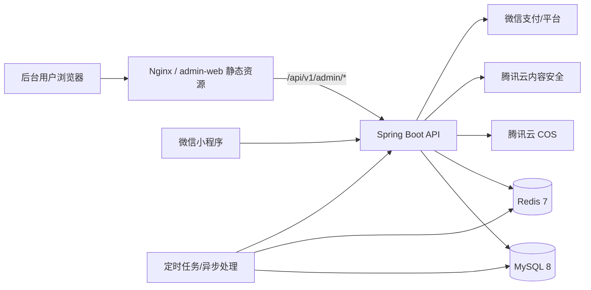
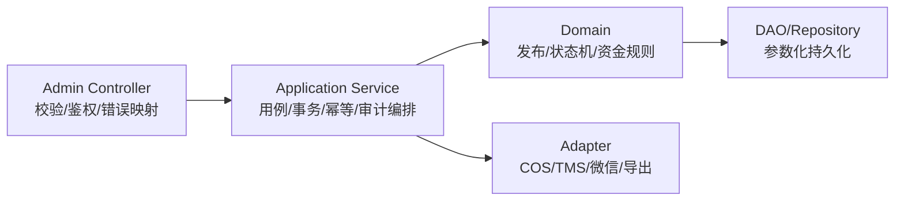

# 星球出机后台管理网站技术架构与 Docker 部署

## 1. 文档定位与架构决策

本文档给出后台管理网站目标架构和 Docker 部署方案。它建立在已有 Spring Boot 服务、MySQL、Redis 及小程序业务域之上，不代表管理端代码或管理 API 已完整实现。

| 决策项 | 方案 |
| --- | --- |
| 后台 Web | 独立 `admin-web` 工程，Vue 3 + TypeScript + Vite；与 UniApp 的 Vue 技术方向一致但不复用小程序页面 |
| UI/图表 | Element Plus（或团队确认的企业组件库）+ ECharts，图标采用 SVG/组件图标 |
| API 服务 | 复用 Spring Boot 3.2 / Java 17 服务，在模块边界内新增或治理 `/api/v1/admin/**` |
| 数据 | MySQL 8 为权威源；Redis 7 用于配置缓存、会话/限流、锁和临时任务状态 |
| 文件与外部服务 | 腾讯云 COS、内容安全、微信支付等仍由后端 Adapter 调用 |
| 部署 | Docker 镜像化部署；Nginx 提供后台静态站点并反向代理 API；敏感参数外置 |
| API 契约 | 先更新 OpenAPI，再开发后台页面/API；当前占位 OpenAPI 不足以直接实施 |

## 2. 总体拓扑



### 2.1 容器职责

| 容器/服务 | 职责 | 数据持久性 | 暴露策略 |
| --- | --- | --- | --- |
| `admin-web`/`nginx` | 提供构建后的 Web 静态资源、gzip/缓存、安全响应头、API 代理 | 无状态 | 对外 `443`，开发可用 `80` |
| `backend` | 管理端及小程序 REST API、认证、业务编排、审计、适配外部服务 | 无状态，文件不落本机 | 仅由 Nginx/内网访问，健康端点例外 |
| `mysql` | 权威业务数据与审计记录 | Docker volume 或生产托管数据库 | 生产不直接公网暴露 |
| `redis` | 缓存、限流、会话、分布式锁 | 依用途决定 AOF/备份 | 仅内部网络 |
| 可选 `job/worker` | 汇总指标、异步导出、配置生效/结算任务 | 任务状态落 MySQL | 仅内部网络 |

生产环境优先采用云托管 MySQL/Redis；若自管容器，须补齐备份、主机磁盘监控和恢复演练。

## 3. 后台前端架构

### 3.1 工程目标结构

```text
admin-web/
  src/
    api/                 # 由 OpenAPI 生成或手写薄封装，统一错误模型
    auth/                # token、权限守卫、路由鉴权
    components/          # 表格、筛选、状态标签、审计抽屉
    layouts/             # 登录和管理台布局
    modules/
      dashboard/
      catalog/
      operations/
      orders/
      users/
      moderation/
      finance/
      repair/
      analytics/
      system/
    router/
    stores/
    utils/               # money/time/traceId/download 等统一工具
  Dockerfile
  nginx.conf
```

### 3.2 前端职责边界

| 层 | 职责 | 禁止事项 |
| --- | --- | --- |
| View/Module | 页面组织、交互状态、表单与图表呈现 | 不自行更改业务状态机或计算最终金额 |
| Store | 用户会话、权限、筛选缓存、待办角标 | 不缓存明文敏感数据到持久存储 |
| API Client | Bearer、traceId、错误归一、取消重复查询、DTO 类型 | 不绕开 OpenAPI 私造字段 |
| Mapper/Formatter | 整数分展示、ISO 时间展示、枚举标签映射 | 不修改服务端语义 |

### 3.3 Web 安全策略

- 后台 token 推荐置于 `HttpOnly`、`Secure`、`SameSite` Cookie 并配合 CSRF 防护；若必须 Bearer 存储，需限定有效期、刷新与 XSS 防护方案。
- 路由守卫只提供交互控制，权限判断仍由后端执行。
- 富文本/运营内容预览使用允许列表消毒；媒体下载使用受限签名 URL。
- Nginx 设置 TLS、CSP、`X-Content-Type-Options`、`Referrer-Policy` 等安全响应头。

## 4. 后端管理域架构

### 4.1 分层要求

后台不是独立改库通道。所有管理写操作必须复用相应业务领域规则：



| 业务模块 | 管理用例示例 | 领域约束 |
| --- | --- | --- |
| Catalog | 编辑 SKU、媒体、价格、上下架、场景关联 | 金额整数分；发布状态有效；媒体审核 |
| Operations | 编辑配置、生成版本、定时发布/回滚 | `config_version` 单调演进；发布审计与缓存失效 |
| Moderation | 查询待审、批准/驳回帖子 | `AUDITING/MANUAL_REVIEW` 到合法结果；原因必填 |
| Order/Finance | 查询订单流水、提现审批、结算异常处理 | 状态机、幂等、追加流水，不直接改余额 |
| Repair | 派单、巡检计划、反馈/知识发布 | 工单与巡检状态机；区域数据权限 |
| Reporting | 汇总指标、创建导出任务 | 口径版本化；脱敏和下载有效期 |

### 4.2 外部依赖与容错

- 微信、COS、腾讯云内容安全及后续 IM/导出存储访问统一由 Adapter 封装；Controller 与 Domain 不直接调用第三方 SDK。
- 每个外部客户端必须配置连接/响应超时、有限次重试和可识别错误码；审核超时进入人工队列，支付/提现类动作不得因盲目重试造成重复入账。
- 外部失败、降级动作和重试耗时关联 `traceId` 记录，供后台异常工作台和告警定位。

### 4.3 对现有骨架的治理要求

当前源码中可见 `AdminAuthController`、`AdminSkuController`、`AdminConfigController`、`AdminPostController`、`AdminOrderController`、`AdminDistributionController` 和 `AdminUserController`，可作为实现盘点输入，但需要在实施阶段完成：

- 将 Controller 内直接 Mapper 查询/写入迁移到 Application Service 与 Domain 规则下，保持五层边界。
- 为输入 DTO 增加类型、长度、枚举、金额和并发版本校验，避免直接接收实体或无约束 `Map`。
- 将路径、请求响应 Schema、错误码、权限和审计字段正式写入 OpenAPI。
- 补齐管理动作审计、traceId、资源级权限、资金写入隔离与自动化测试。

## 5. API 与权限设计

### 5.1 路径资源分组（目标设计）

以下为契约定稿的资源边界，不是当前 OpenAPI 已发布端点：

| 路径前缀 | 资源 | 关键动作 |
| --- | --- | --- |
| `/api/v1/admin/auth` | 管理会话 | 登录、退出、当前管理员、刷新会话 |
| `/api/v1/admin/dashboard` | 工作台 | 待办、经营概览、告警摘要 |
| `/api/v1/admin/catalog` | 商品与场景 | SKU/媒体/价格/上下架/场景组合 |
| `/api/v1/admin/operations` | 配置与活动承载 | 草稿、预览、发布、版本、回滚、话题/运营位 |
| `/api/v1/admin/moderation` | 内容审核 | 队列、详情、审核动作、日志 |
| `/api/v1/admin/orders` | 订单与履约 | 查询、事件/合同/支付异常查看 |
| `/api/v1/admin/users` | 用户/权益/资产 | 查询、受控冻结、会员/托管摘要 |
| `/api/v1/admin/finance` | 钱包/提现/结算 | 流水查询、审批/重试、对账 |
| `/api/v1/admin/distribution` | 分销 | 佣金、关系、批次 |
| `/api/v1/admin/repair` | 报修巡检 | 设备、工单、计划、任务、反馈、知识 |
| `/api/v1/admin/analytics` | 报表与导出 | 聚合查询、导出任务 |
| `/api/v1/admin/system` | 系统治理 | 管理员、角色权限、审计、运行状态 |

### 5.2 通用契约要求

- 路径沿用 `/api/v1`；JSON 使用 camelCase；时间使用带时区 ISO-8601；金额为整数分。
- 列表管理场景使用 `page`、`pageSize` 并返回 `items` 与 `total`；Feed 类数据仍可使用游标。
- 写操作支持乐观锁或发布版本校验；发布、审批、重试等防重动作使用 `Idempotency-Key` 或业务唯一键。
- 响应统一返回 `success`、`data`/`error` 和 `traceId`。
- 后台错误码需独立定稿，例如无权限、发布版本冲突、无效审核迁移、导出权限不足，不以模糊 500 替代。

### 5.3 RBAC 与审计模型

| 模型 | 必要字段 |
| --- | --- |
| `admin_users` | id、username、passwordHash、displayName、status、lastLoginAt |
| `admin_roles` / `admin_permissions` | role、resource、action、dataScope |
| `admin_user_roles` | adminId、roleId、effectiveAt、revokedAt |
| `admin_operation_logs` | operatorId、action、resourceType、resourceId、beforeJson/afterJson 脱敏、reason、traceId、createdAt |
| `export_jobs` | requesterId、querySnapshot、status、objectKey、expiresAt、createdAt |

现有 `admin_users` 可演进使用；角色权限、审计和导出任务是后台达到生产可用所需的补充数据模型。

## 6. 数据、缓存与分析

### 6.1 数据所有权

| 数据 | 权威源 | 缓存/衍生数据 |
| --- | --- | --- |
| SKU、场景、配置版本 | MySQL | Redis 公开配置和热门读取缓存 |
| 订单、支付、钱包、佣金 | MySQL 交易/流水表 | 报表汇总，不可替代权威账务 |
| 社区帖子与审核结果 | MySQL；素材对象在 COS | 待办计数缓存 |
| 报修与巡检 | MySQL | 驾驶舱聚合 |
| 埋点 | 事件存储或接入的分析存储（实施定稿） | 日/小时聚合指标 |

### 6.2 缓存一致性

- 运营配置发布成功后，事务提交再失效/刷新 Redis 缓存；失败不得提前污染线上读取。
- SKU 上下架或价格发布引起相关列表和详情缓存失效；订单试算仍以主库/领域规则为准。
- 缓存不可作为钱包余额、支付成功或结算结果的唯一依据。

### 6.3 报表方案

- 一期可使用 MySQL 聚合查询加定时汇总表支撑运营看板，避免对核心交易查询施加过大负载。
- 埋点事件至少携带事件名、时间、页面/来源、SKU/专题/配置版本（适用时）和匿名用户关联键。
- 指标定义与刷新周期写入报表接口文档；财务级对账从权威流水产生，不使用埋点推算。

## 7. Docker 容器化方案

### 7.1 镜像与网络

| 镜像 | 构建策略 | 生产要点 |
| --- | --- | --- |
| `admin-web` | Node LTS 多阶段构建 Vite 静态文件，最终使用 `nginx:alpine` 提供服务 | 非 root/只读静态文件、安全头、TLS 终止或接入外部负载均衡 |
| `backend` | Maven 构建 Jar，运行镜像使用 JRE 17 | 非 root 用户、JVM 资源限制、`/actuator/health` |
| `mysql` | `mysql:8.0` 或云数据库 | utf8mb4、数据卷/备份、账号最小权限 |
| `redis` | `redis:7-alpine` 或云缓存 | 密码/TLS 按环境、持久化与内网隔离 |

服务放入内部 Docker network；仅 Nginx/负载均衡对外，数据库与 Redis 不对公网映射端口。

### 7.2 目标 Compose 结构

根目录已有 `mysql`、`redis`、`backend` 和挂载 `./admin-web/dist` 的 `nginx` 配置雏形。正式部署建议将静态站点也构建成不可变镜像，并将开发依赖与生产部署配置分离：

```yaml
services:
  admin-web:
    image: registry.example.com/xingqiu/admin-web:${ADMIN_WEB_TAG}
    depends_on:
      backend:
        condition: service_healthy
    ports:
      - "443:443"
    networks: [edge, internal]
    restart: unless-stopped

  backend:
    image: registry.example.com/xingqiu/backend:${BACKEND_TAG}
    env_file: [.env.production]
    healthcheck:
      test: ["CMD", "wget", "-qO-", "http://localhost:8080/actuator/health"]
    networks: [internal]
    restart: unless-stopped

  mysql:
    image: mysql:8.0
    volumes: [mysql_data:/var/lib/mysql]
    networks: [internal]

  redis:
    image: redis:7-alpine
    volumes: [redis_data:/data]
    networks: [internal]

networks:
  edge: {}
  internal:
    internal: true
volumes:
  mysql_data: {}
  redis_data: {}
```

该片段表达部署目标，实际文件须在实现阶段补入 TLS、密钥注入、数据库迁移、监控和环境参数后接受评审。

### 7.3 配置与密钥

| 参数类别 | 示例 | 管理方式 |
| --- | --- | --- |
| 数据库/Redis | URL、用户、密码 | Secret 管理服务或受控 `.env`，禁止提交生产值 |
| 后台认证 | JWT/Session secret、Cookie 域、过期策略 | 环境密钥，定期轮换 |
| 外部适配 | 微信、COS、TMS 密钥和证书 | 只读 Secret 挂载/云密钥服务 |
| 前端环境 | API base URL、版本号 | 构建参数；不得包含服务端密钥 |

当前根级 Compose 中存在便于开发的默认密码与 JWT 默认值，仅可用于本地环境，生产发布前必须移除默认兜底并轮换真实秘密。

## 8. 可观测性、健康检查与备份

### 8.1 健康和就绪

| 服务 | 存活检查 | 就绪检查 |
| --- | --- | --- |
| Nginx/admin-web | 静态 `/healthz` 返回 200 | 代理后台健康端点可用 |
| Backend | Spring Actuator liveness | MySQL/Redis 连接、必要配置加载正常 |
| MySQL | `mysqladmin ping` | 迁移版本符合应用要求 |
| Redis | `redis-cli ping`（凭证保护） | 应用读写/锁测试正常 |

- 镜像构建时必须包含健康检查所使用的工具，或使用应用/JVM 自带可执行方案；例如 Compose 示例中的 `wget` 仅在运行镜像已安装时有效。

### 8.2 日志与指标

- Nginx 记录访问状态、请求耗时与传入/生成的 traceId；严禁日志输出 token。
- Backend 记录登录失败、权限拒绝、配置发布、审核、资金处置、导出和外部依赖失败，并将 traceId 返回调用端。
- 指标至少覆盖 API 5xx/延迟、登录失败、配置发布失败、TMS/微信/COS 调用失败、待审核积压、提现/结算异常、工单逾期和容器资源。

### 8.3 备份与恢复

- MySQL：发布前备份与周期备份；审计、账务与配置版本数据纳入恢复验证。
- Redis：不依赖其恢复账务真相；若承载会话/任务进度，应明确重启后的降级行为。
- COS：对发布素材和导出文件配置生命周期与访问权限；回滚配置时不直接删除仍被旧版本引用的对象。

## 9. 发布、验证与回滚

### 9.1 发布顺序

1. 评审并冻结 OpenAPI、数据库迁移和权限矩阵。
2. 构建带版本标签的 `backend` 与 `admin-web` 镜像并执行自动化测试/依赖扫描。
3. 备份数据库；先部署兼容旧前端的后端与迁移，再发布后台静态站点镜像。
4. 执行健康检查、管理员登录/RBAC、商品读取、配置草稿与预览、审计写入和关键看板冒烟测试。
5. 观察错误率、延迟、外部依赖失败和审计异常后关闭发布窗口。

### 9.2 回滚路径

| 故障类型 | 回滚动作 |
| --- | --- |
| 前端静态资源异常 | 将 `admin-web` 镜像标签回退到上一版本；不改动数据 |
| 后端兼容性/运行错误 | 回退 `backend` 镜像；数据库迁移必须使用向后兼容或配套回退脚本 |
| 运营内容误发布 | 在后台以已验证旧配置生成新的发布版本并触发缓存失效，保留审计 |
| 数据写入/资金异常 | 停止相关高风险动作，依据流水和审计走冲正/修复审批，不直接回写余额 |
| 数据库/存储故障 | 按备份恢复演练步骤处置并核验审计、账务和配置版本一致性 |

## 10. 实施门禁与风险

### 10.1 开发前 P0 门禁

- 明确活动一期是否仅为运营展示配置；交易型营销需求另行评审。
- 将管理端 API、DTO、枚举、错误码和鉴权写入 OpenAPI。
- 确认角色/数据范围矩阵、审计字段、敏感字段脱敏与导出审批策略。
- 盘点已有 `admin` 后端骨架并修正越层访问、输入校验、审计与测试缺口。

### 10.2 风险清单

| 风险 | 影响 | 控制措施 |
| --- | --- | --- |
| 后台 UI 基于未定稿接口先行开发 | 字段漂移、权限漏洞 | OpenAPI 先行并生成类型 |
| 后台直接更新价格/资金/状态表 | 交易和审计不可恢复 | 只经领域服务写入、追加流水、审批与幂等 |
| 配置缓存发布不一致 | 小程序展示新旧混乱 | 版本化发布、事务后失效、可回滚 |
| 生产 Compose 沿用本地默认密钥 | 管理端被攻破 | Secret 外置、无默认生产值、TLS 和轮换 |
| 看板口径未确认 | 经营判断和对账冲突 | 指标口径版本化并与财务权威流水区分 |

## 11. 与已有文档/资产的关系

- 本方案复用 `docs/backend/BE-01-13` 中的业务领域和 `docs/frontend/FE-01-13` 暴露的运营诉求。
- `docs/api/API-01-07` 提供业务说明，真正开发时必须先扩充 `docs/api/openapi/openapi.yaml`。
- 根级 `docker-compose.yml` 已体现 MySQL、Redis、Backend、Nginx 的本地运行轮廓；本文给出管理网站生产化所需的镜像化、安全与回滚补强。
- 已有后台源码仅作为实施盘点资产，后续代码必须接受分层、安全和契约评审。
