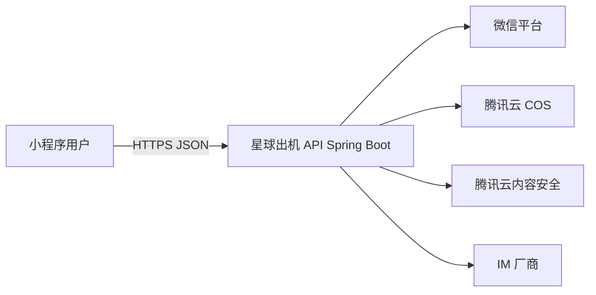

# 01 - 系统总览与领域边界

## 1. 系统上下文

- **用户**：微信小程序（UniApp 构建）。
- **星球出机 API**：Spring Boot 单体或可演进模块化部署，HTTPS 对外。
- **管理端**：商家/运营/审核后台（独立工程，本仓库文档仅约束其 **对外配置与审核结果** 与小程序 API 的契约；实现不在此小程序仓库）。

## 2. 领域划分（后端逻辑边界）

| 限界上下文 | 职责 | 与小程序模块对应 |
|------------|------|------------------|
| 用户与会话 | 微信 code 换会话、用户资料、设备指纹（可选） | FE-01、BE-01 |
| 运营配置 | 版本化配置只读下发 | FE-01、BE-11 |
| 商品与目录 | SKU、价格策略、场景聚合、搜索索引 | FE-02～03、BE-02 |
| 订单与计价 | 购物车/立即购、试算、状态机 | FE-04～05、BE-03 |
| 支付 | 预支付、回调、关单、对账 | FE-04、BE-04 |
| 合同 | 生成、存储、签名 URL | FE-04～05、BE-05 |
| 会员与权益 | 等级、原住民、星球卡、核销 | FE-06、BE-06 |
| 钱包 | 光年币、流水、提现受理 | FE-07、BE-07 |
| 托管与资产 | 分身资产、时段、冲突锁、收益展示 | FE-08、BE-08 |
| 社区 | 帖子、圈子、话题、审核状态 | FE-09、BE-09 |
| 消息 IM | Token、会话同步（与 IM 厂商） | FE-10、BE-12 |
| 分销 | 邀请码、树、佣金、结算批次 | FE-11、BE-10 |

## 3. 数据所有权

- **主库**：订单、支付单、钱包流水、佣金单、用户等级快照等为 **权威数据源**；小程序仅展示与触发动作。
- **COS**：大对象正文（图片、视频、PDF）；库中仅存 `objectKey`、MIME、审核状态。
- **IM**：会话与消息体主要在厂商；本地仅存映射关系与审计必要字段。

## 4. 跨领域规则（全局）

- 金额与优惠：**以后端试算接口返回为准**，前端不自行累计优惠后提交最终金额作为唯一依据。
- 订单状态迁移：仅由后端领域服务 + 支付回调 + 定时任务驱动；前端轮询或订阅消息刷新 UI。
