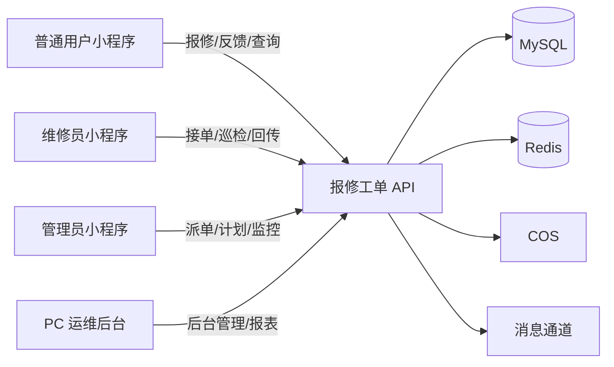

# 04 - 报修工单系统架构与领域边界

> 来源：`docs/报修工单小程序系统功能清单.xlsx`

## 1. 系统目标

- 面向园区/楼宇设备运维场景，建设「报修工单 + 巡检 + 后台管控 + 数据驾驶舱」一体化系统。
- 支持三类小程序角色：普通用户、维修员、管理员。
- 支持 PC 端运维后台：设备管理、工单管理、巡检管理、反馈管理、经验分享、权限管理、统计报表、可视化驾驶舱。

## 2. 系统上下文

## 3. 领域划分

| 限界上下文 | 核心职责 | 来源功能清单映射 |
|------------|----------|------------------|
| 账号与权限 | 用户、维修员、管理员账号；角色权限、禁用、重置密码 | 用户权限管理 |
| 设备与点位 | 设备台账、场所点位、二维码生成与绑定 | 设备管理、扫码报修/扫码巡检 |
| 工单中心 | 报修创建、派单改派、接单拒单、处理闭环、日志追踪 | 工单管理、用户报修、维修员接单 |
| 巡检中心 | 巡检模板、巡检计划、任务分发、巡检记录、异常隐患 | 巡检管理、管理员巡检计划、维修员巡检 |
| 反馈中心 | 意见反馈收集、处理状态追踪 | 意见反馈管理 |
| 知识中心 | 维修经验文章发布、分类、素材 | 维修经验分享 |
| 统计中心 | 多维统计、完成率、逾期率、维修员时效 | 数据统计报表 |
| 驾驶舱 | 核心指标卡片、趋势图、排行图、大屏展示 | 可视化驾驶舱 |
| 通知中心 | 新工单、新巡检、逾期预警通知 | 消息提醒 |

## 4. 三端角色边界

- 普通用户：发起报修、查看进度、扫码报修、反馈建议、查看个人工单。
- 维修员：接单/拒单、处理工单、提交维修记录、执行巡检、扫码巡检。
- 管理员：巡检计划编排、任务下发、全域工单管控、数据看板、通知管理。

## 5. 关键非功能要求

- 可追踪：工单与巡检全链路操作日志留痕。
- 可配置：故障类型、巡检模板、权限策略后台可维护。
- 可扩展：报表与驾驶舱图表支持按区域/人员/时间扩维。
- 可回溯：关键状态流转需保留操作者、时间、原因字段。
