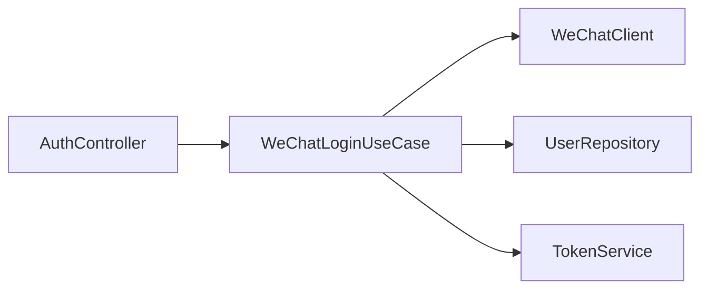

# BE-01 - 用户认证与微信登录

## 1. 功能设计

- 小程序 `code` 换取 openid/unionid（微信服务端 API），创建或更新用户。
- 签发 **会话令牌**（JWT 或随机 session id + Redis）；返回用户摘要（等级、是否原住民）。
- 登出：服务端失效会话（黑名单或删 Redis key）。

## 2. 后端架构

- **Controller**：`AuthController` — `POST /api/v1/auth/wechat`。
- **Application**：`WeChatLoginUseCase` — 调 `WeChatClient`，事务内 upsert `users`。
- **Infrastructure**：`WeChatMiniProgramClient`（RestClient / 官方 SDK）；配置 `appId`、`secret`。
- **Security**：Spring Security 资源服务器或自定义 Filter 校验 Bearer；白名单登录、支付回调、健康检查。

## 3. 持久化要点

- 表 `users`：`openid`、`unionid`（可空）、`nickname`、`avatar_url`、`created_at`。
- 表 `sessions` 或 Redis：`token` → `userId`、`exp`。

## 4. 接口文档

[api/API-01-认证与用户-运营配置.md](../api/API-01-认证与用户-运营配置.md)
