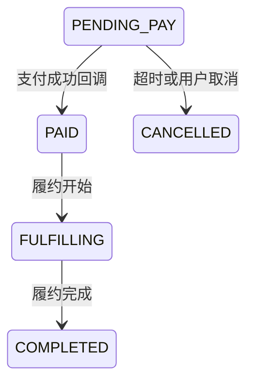

# BE-03 - 订单与计价、状态机

## 1. 功能设计

- 创建订单：校验 SKU 可售、库存/时段冲突（租/托管）；计算金额（含押金、运费、优惠、光年币抵扣上限）。
- **试算接口**：与创建订单共享计价内核，避免两套逻辑。
- 状态机：`PENDING_PAY` → `PAID` / `CANCELLED` → `FULFILLING` → `COMPLETED`；异常分支：`REFUNDING`（若需要）。
- 超时未支付：定时任务关单并释放锁。

## 2. 后端架构

- **领域**：`Order` 聚合根，`OrderStatus` 枚举，`OrderDomainService.transition()` 集中校验迁移。
- **应用**：`CreateOrderUseCase`、`PreviewOrderUseCase`；`@Transactional` 边界在应用服务。
- **并发**：租期与托管设备使用 **Redis 分布式锁** 或 DB 悲观锁（二选一并文档化）。

## 3. 持久化要点

- `orders`、`order_lines`、`order_price_breakdown`（JSON 或子表）。
- 事件表 `order_events`（审计：状态、操作者、时间）。

## 4. 接口文档

[api/API-03-订单计价支付与合同.md](../api/API-03-订单计价支付与合同.md)
