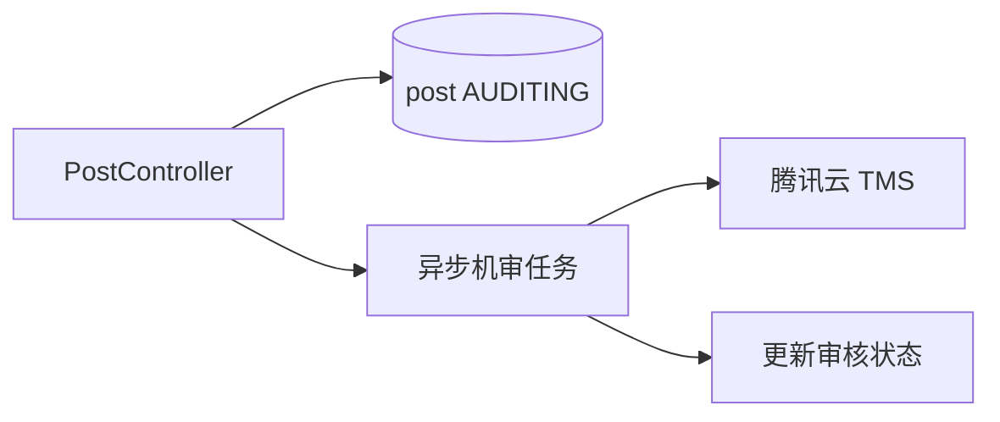

# BE-09 - 社区内容与腾讯云机审

## 1. 功能设计

- 帖子创建：先落库 `AUDITING`，文本与图片 URL 调 **腾讯云内容安全**；根据结果更新 `APPROVED` / `REJECTED` / `MANUAL_REVIEW`。
- 人审：运营后台改状态；小程序轮询或推送刷新。
- 评论同理；图片可先审 URL（COS 已上传对象）。

## 2. 后端架构

- `ContentModerationClient` 封装 TMS；超时与降级策略（入人工队列）。
- 异步：Spring `@Async` 或 MQ 消费者处理机审，避免阻塞发帖接口（可先同步 MVP 再优化）。

## 3. 持久化要点

- `posts`、`post_media`、`post_audit_logs`（机审原始响应 JSON 脱敏存储）。

## 4. 接口文档

[api/API-05-社区与消息.md](../api/API-05-社区与消息.md)
