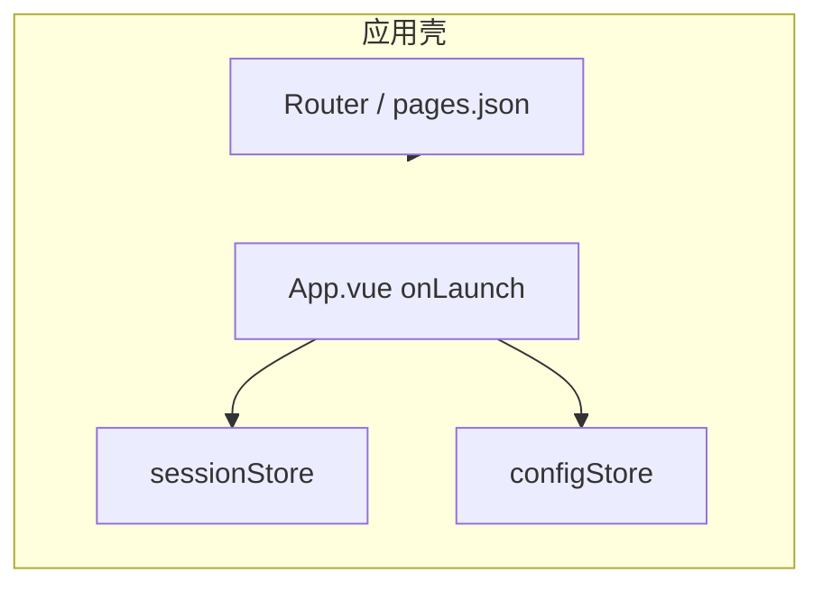

# FE-01 - 应用壳、路由与运营配置

## 1. 功能设计

- **启动**：检查更新（可选）、读取本地 `sessionToken`，无则进入登录流程（`wx.login` → 后端换 token）。
- **全局 Tab（已实现）**：首页（货架聚合 + 搜索 + 租/买/软件入口）、**分类**（`pages/catalog/index`）、**社区**（`pages/community/index`）、**我的**（`pages/mine/index`）。购物车从首页快捷入口或业务流进入，不占底栏（与「购物车或我的」取舍一致）。
- **运营配置**：等级文案、佣金展示开关、话题列表、星球卡 SKU 等 **只读展示**，数据来自配置接口，**禁止硬编码业务数值**。
- **我的**：用户信息、会员徽章入口、设置、客服入口。

## 2. 前端架构

| 项 | 建议 |
|----|------|
| 路由 | `pages.json` 声明式配置；分包：`package-order`、`package-community` 等按体积与访问频率划分 |
| 状态 | Pinia（Vue3）或等价；`useSessionStore`、`useConfigStore` |
| 网络 | `services/http.ts` 统一 baseURL、拦截器附 Bearer、401 清 token 跳转登录 |
| 配置刷新 | App `onLaunch` 拉全量配置；关键页 `onShow` 可带 `ETag` 或版本号增量拉取 |

## 3. 页面清单（示例）

- `pages/home/index`：首页容器。
- `pages/catalog/index`：分类货架与场景入口（支持 `?type=rent|buy|software`）。
- `pages/community/index`：社区 Feed。
- `pages/mine/index`：我的；登录可静默无独立页。

## 4. 依赖接口

见 [api/API-01-认证与用户-运营配置.md](../api/API-01-认证与用户-运营配置.md)。

## 5. 验收要点

- 配置变更后用户下次进入或下拉刷新可见新文案（与缓存策略一致）。
- 未登录态下仅允许浏览与登录，下单等操作引导登录。
