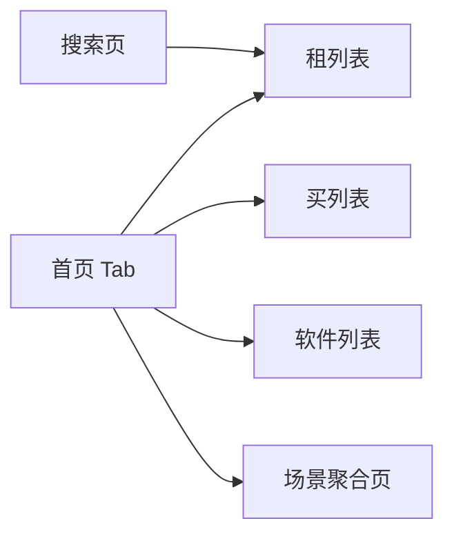

# FE-02 - 商品货架、搜索与场景

## 1. 功能设计

- **三大主入口**：租机器人、买机器人、软件程序；各自列表支持品牌、价格区间、适配机型等筛选（以后端/配置为准）。
- **场景入口**：年会、展会、门店等；进入后为 **场景聚合页**（可租/可买/配软件组合卡片）。
- **搜索**：多维度：名称、场景、品牌、价格区间、适配型号；支持历史与热搜（可选，后端配置）。

## 2. 前端架构

| 项 | 建议 |
|----|------|
| 组件 | `ProductCard`、`FilterDrawer`、`SceneHero`；筛选条件与 URL query 或 store 同步便于分享 |
| 列表 | 分页加载（触底）；骨架屏；空态与错误重试 |
| 数据 | `services/catalog.ts`：`listSkus`、`listSceneBundles` |

## 3. 页面清单（示例）

- `pages/catalog/rent`、`buy`、`software`
- `pages/scene/detail`
- `pages/search/index`

## 4. 依赖接口

见 [api/API-02-商品场景与搜索.md](../api/API-02-商品场景与搜索.md)。

## 5. 验收要点

- 筛选变更触发重新请求，防抖 300ms（搜索框）。
- 与后端字段枚举一致，不在前端写死全部品牌列表（可由配置或搜索联想接口提供）。
