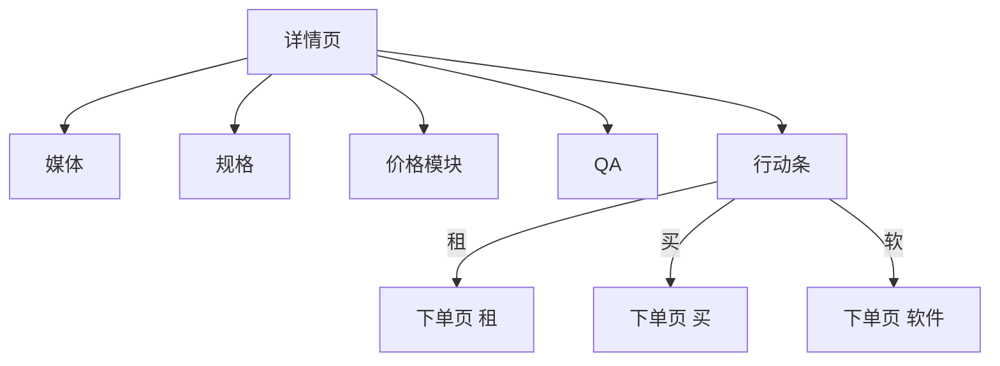

# FE-03 - 商品详情

## 1. 功能设计

- **统一模板**：租 / 买 / 软件共用详情壳，按 `skuType` 切换模块显隐。
- **媒体区**：视频优先，不支持时降级多图轮播；全屏预览与分享图（若产品需要）。
- **参数区**：型号、尺寸、续航、功能标签；软件额外展示 **适配机型**、授权类型说明。
- **价格模块**：租（日/周/月阶梯 + 首租优惠标签）、买（一口价 + 分期说明占位）、软件（永久/年付 + 是否含更新）。
- **QA 折叠**：押金、运费险、故障、售后（文案来自运营配置）。
- **行动条**：「立即租赁」「立即购买」「获取软件」按品类显示 1～3 个主按钮。

## 2. 前端架构

- 路由参数：`skuId`；进入页拉详情 `GET /catalog/skus/{id}`。
- 价格展示 **完全使用接口返回结构**，不自行拼接阶梯文案逻辑与后端重复实现（可前端格式化数字）。
- 组件：`MediaGallery`、`SpecTable`、`PriceBlock`、`QaCollapse`、`StickyActionBar`。

## 3. 依赖接口

见 [api/API-02-商品场景与搜索.md](../api/API-02-商品场景与搜索.md) 中详情与价格相关端点。

## 4. 验收要点

- 缺货或不可租时段：按钮置灰并提示原因（后端 `availability`）。
- 软件未适配当前用户设备时明确提示（若业务需要设备绑定）。
