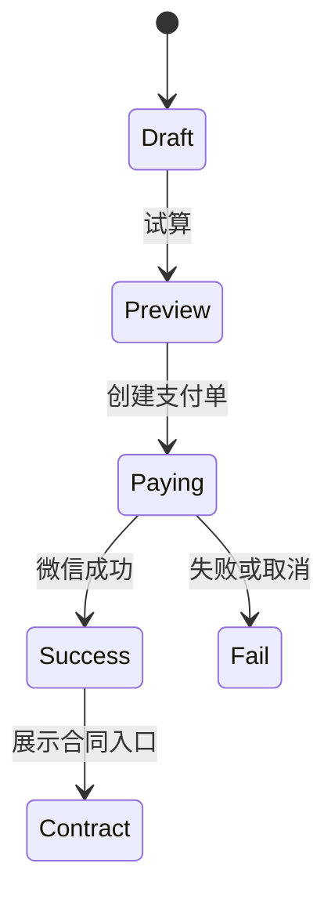

# FE-04 - 下单、计价、支付与合同

## 1. 功能设计

- **步骤机**：选商品类型 → 填信息（租：租期+时段+地点；买：地址；软件：授权类型）→ **试算**（券、光年币）→ 调起微信支付（定金/全款由后端返回 `payMode`）→ 结果页 → 订单详情。
- **合同**：支付成功后展示「查看电子合同」；下载走小程序内 **临时 HTTPS 链接** 或 web-view（按合规选型）。

## 2. 前端架构

- 使用 **单页多步** 或 **子路由步骤**；每步数据写入 `orderDraftStore`，提交前再 `POST /orders` 或 `POST /orders:preview` + `POST /orders/{id}/pay`。
- **禁止**用前端计算金额作为最终提交唯一依据：提交后以后端订单金额为准；试算与支付参数以后端返回的 `prepayId` 相关字段为准。
- 支付：`uni.requestPayment`（微信）；监听成功/失败与取消。

## 3. 页面清单（示例）

- `pages/order/create`（多步）
- `pages/order/pay-result`

## 4. 依赖接口

见 [api/API-03-订单计价支付与合同.md](../api/API-03-订单计价支付与合同.md)。

## 5. 验收要点

- 断网重进：可从草稿恢复或提示重新下单（与产品一致）。
- 支付成功回调以服务端为准；前端轮询订单状态或 WebSocket（若二期）。
