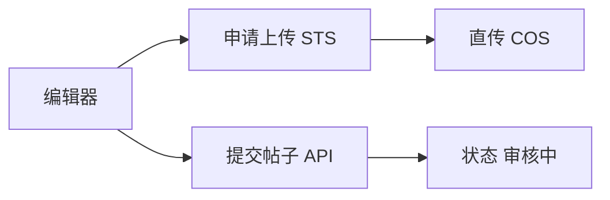

# FE-09 - 社区动态、话题与圈子

## 1. 功能设计

- **Feed**：推荐/关注（若二期）/话题；帖子卡片图文与短视频封面。
- **发帖**：富文本或结构化块；图片/视频走 **COS 直传凭证**；提交后展示 **审核中 / 已通过 / 未通过（原因）**（机审+人审）。
- **话题**：预置话题列表（运营配置）+ UGC 话题策略以后端为准。
- **圈子**：列表、加入、圈内动态流。

## 2. 前端架构

- 分包 `package-community`；组件 `PostCard`、`EditorToolbar`、`MediaUploader`。
- 内容安全：**不在前端判断「是否违规」**；仅展示后端返回的审核状态与可播放/可见范围。

## 3. 依赖接口

见 [api/API-05-社区与消息.md](../api/API-05-社区与消息.md)。

## 4. 验收要点

- 视频首帧作为封面参与机审策略与产品一致；失败时允许用户更换封面重提。
