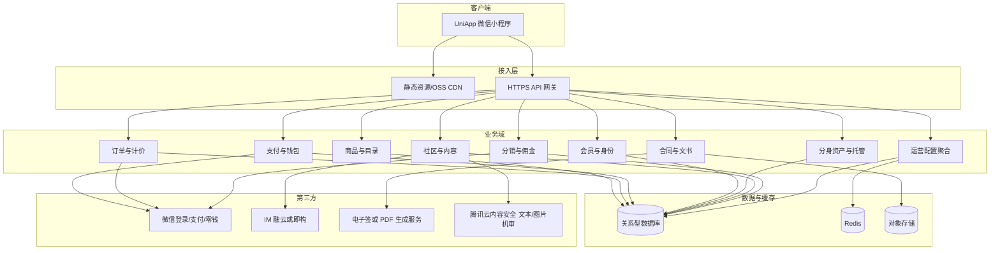

# 星球出机小程序：技术架构与开发准备

> 依据《星球出机小程序需求文档 V1.1》整理。后台商家管理、运营配置、内容审核等不在小程序端范围内，但小程序依赖其配置类接口。

## 文档分册索引（细化版）

| 分类 | 路径 | 说明 |
|------|------|------|
| 总索引 | [README.md](./README.md) | 全库文档导航 |
| 架构 | [architecture/](./architecture/) | 总览、选型与部署、安全与观测 |
| 前端 | [frontend/](./frontend/) | FE-01～FE-12 功能设计 + 前端架构一体 |
| 后端 | [backend/](./backend/) | BE-01～BE-12 功能设计 + Spring Boot 架构一体 |
| 接口 | [api/](./api/) | **openapi/openapi.yaml（真源）** + `00-接口通则` + API-01～06 补充 |

**已定技术栈**：UniApp（微信小程序）+ **Java 17 + Spring Boot 3.x**；不采用微信云开发；社区机审为腾讯云内容安全。

---

## 1. 需求范围摘要

| 层级 | 范围 |
|------|------|
| 刚性 | 商品货架（租/买/软件）、场景入口、搜索、商品详情、统一下单与支付、订单状态机、电子合同、订单中心 |
| 次重点 | 原住民身份、托管出租、光年钱包与提现、会员等级与权益、付费星球卡 |
| 衍生 | 星球社区（帖/圈子/私信/群聊）、分销中心（邀请码、团队、佣金、提现） |
| 非功能 | 运营配置动态下发、风控、埋点预留、支付与合同、一页纸三流（交易/身份/社群） |

---

## 2. 架构总览

采用 **UniApp 微信小程序端 + Java Spring Boot 自建业务后端 + 第三方能力** 的分层结构；运营配置、分佣规则、等级规则等 **只读后台配置接口**，不在端上硬编码。

---

## 3. 子系统与职责边界

### 3.1 交易子系统

- **商品**：租/买/软件三类 SKU；软件适配机型；阶梯租价、购买价、订阅/永久授权。
- **场景**：场景标签聚合可租/可买/配软件组合（配置驱动）。
- **搜索**：多维度检索与排序（索引与查询规范需单独设计）。
- **下单**：统一步骤机（租期/时段/地点、地址、授权类型）→ 费用试算（券、光年币）→ 微信支付（定金/全款策略按品类）→ 订单与合同。
- **订单状态**：待付款 → 已支付/待履约 → 履约中/已发货 → 已完成 → 已取消；超时取消、托管冲突锁定等归风控与领域服务。

### 3.2 会员与资产子系统

- **身份**：首单付费后原住民 Lv.1；购买机器人进「分身资产」。
- **托管**：可租时段、平台统一定价、设备状态与收益、与订单侧防超卖/冲突。
- **等级**：L0–L3 规则由后台计算，端上展示与核销权益（折扣、免押次数、分润层级等读配置）。

### 3.3 社区与 IM

- **内容**：图文、短视频、话题、圈子、动态流。社区发帖与评论中的 **文字**、以及配图/封面等 **图片**，在业务后端写入公域前调用 **腾讯云内容安全** 侧提供的 **文本审核、图片审核（自动机审）** 接口；根据返回标签与置信度做拦截、仅自己可见或进人工复核队列（与运营后台衔接）。展示层仍做 XSS 与白名单策略，机审不能替代输入校验。
- **视频**：若一期全量视频机审成本或时延较高，可采用「先审封面/首帧图 + 延迟发布」或与腾讯云视频类审核能力分阶段对接。
- **IM**：私信与群聊；选型融云或即构，需统一用户 ID 映射、会话与推送策略。IM 侧文本/图片是否同步走腾讯云机审，需在 IM 回调或业务中继层统一设计，避免漏审。

### 3.4 分销与钱包

- **推广**：邀请码、海报、链接归因。
- **佣金**：一级/二级、待结算/可提现、维权期 7 天、T+7、异常冻结。
- **光年钱包**：与订单、社区积分兑换联动；提现企业付款到零钱。

### 3.5 合同与文书

- 支付成功后生成电子协议（字段：用户、商品、金额、租期等）；预览与下载走受控链接（鉴权 + 短期签名）。

### 3.6 运营配置子系统（后台实现，小程序只消费）

- 等级规则、权益文案与数值、佣金比例、话题与圈子运营位、星球卡价格与有效期、托管统一定价等：**版本化配置 + 缓存**，小程序启动或进入关键页拉取。

---

## 4. 技术选型与决策建议（摘要）

**已定**：**Java 17 + Spring Boot 3.x** 自建后端；**不采用微信云开发**；UniApp 微信小程序；社区机审 **腾讯云内容安全**；MySQL + Redis + COS。

| 项 | 建议 |
|----|------|
| 前端 | UniApp 发行为微信小程序 |
| 后端 | Spring Boot 单体起步，包结构按限界上下文划分（见 `docs/backend/`） |
| 社区机审 | 腾讯云文本/图片审核 API，仅服务端调用 |
| 数据库 / 缓存 | MySQL 8、Redis |
| IM | 融云或即构（待定） |

**服务器分档、Spring 工程目录、部署拓扑** 已迁移至 [architecture/02-技术选型与部署拓扑.md](./architecture/02-技术选型与部署拓扑.md) 与上文索引中的架构分册。

---

## 5. 核心领域模型（粗粒度）

便于前后端对齐表结构与接口，非最终 ER 图。

- **用户**：微信 openid/unionid、会员等级、原住民标记、光年币余额引用。
- **商品/SKU**：品类（租/买/软）、规格、适配机型、媒体、价格策略（阶梯/一口价/订阅）。
- **场景**：场景元数据、与 SKU 的关联（多对多或配置 JSON，需可运营）。
- **订单**：类型、金额结构（商品/押金/运费/优惠）、支付单号、状态机、履约子状态。
- **合同**：订单关联、文件存储 key、签署状态（若走电子签）。
- **钱包与流水**：充值/消费/提现/佣金入账；不可变流水表。
- **托管资产**：设备、时段、状态、与订单锁定关系。
- **社区**：帖子、媒体、话题、圈子、成员、积分流水。
- **分销**：邀请关系树、订单归因、佣金单、结算批次、维权期字段。
- **运营配置**：键值或版本化 JSON + 生效时间。

---

## 6. 对外集成清单

| 集成 | 用途 | 准备材料 |
|------|------|----------|
| 微信小程序 | 宿主、登录 | 小程序 AppID、类目与资质、服务器域名（request/socket/upload/download） |
| 微信支付 | 下单、退款（若需要） | 商户号、APIv3 密钥、证书、进件主体与结算信息 |
| 企业付款到零钱 | 分销/钱包提现 | 商户产品权限、用户实名与风控规则 |
| IM | 私信、群聊 | 厂商账号、应用 key、小程序 SDK 集成说明 |
| OSS | 图片/视频/合同 | 桶、跨域、CDN、私有读签名 |
| 腾讯云内容安全 | 社区文本/图片机审 | 子账号、SecretId/Key、策略阈值、回调（若有）、计费套餐 |
| 电子签或 PDF | 合同 | 模板定稿、盖章流程、回调 URL |

---

## 7. 安全与合规要点（与项目 Skill 一致）

- 所有入参服务端校验；鉴权与资源级权限（防 IDOR）。
- SQL 参数化；富文本与社区内容 XSS 与白名单策略。
- 分销与提现：反作弊、设备指纹/频率限制、人工复核入口。
- 合同与订单金额：以后端试算为准，不信任前端金额字段。
- 日志脱敏；密钥 KMS 或环境注入，不入库不入前端包。

---

## 8. 非功能指标（建议立项填写目标值）

- 可用性：核心业务 API 月度可用性目标（如 99.9%）。
- 性能：首页与商品详情首屏、下单试算 P95 延迟。
- 并发：秒杀或热点活动时的扩容与排队策略（若一期不做，写明「二期」）。
- 备份：数据库与 OSS 备份周期、恢复演练频率。

---

## 9. 开发准备清单

### 9.1 账号与资质

- [ ] 微信小程序注册完成，类目含所需经营范围。
- [ ] 微信支付商户进件完成，开通 JSAPI/Native 等所需能力。
- [ ] 企业付款到零钱能力确认（若一期即含提现）。
- [ ] IM 厂商测试应用与小程序插件审核排期。
- [ ] OSS、服务器（或容器集群）资源与备案（若含 Web 域名）。

### 9.2 设计与产物

- [ ] 信息架构：Tab、订单中心、社区、分销入口与路由表。
- [ ] 高保真 UI：货架、详情、下单、订单详情、钱包、等级权益、社区发帖/IM 入口。
- [ ] 接口契约：OpenAPI/Swagger 或等价文档，错误码与分页规范统一。
- [ ] 状态机文档：订单、佣金结算、提现批次。

### 9.3 工程化

- [ ] 仓库结构：UniApp 工程 + 后端独立仓库或 Monorepo（团队约定）。
- [ ] 环境：dev/staging/prod，配置与密钥分离。
- [ ] CI：lint、单测、小程序上传预览流水线（按团队选型）。
- [ ] 埋点字典：事件名、属性、采样策略。

### 9.4 人员与协作

- [ ] 角色：前端、后端、测试、产品、运营、法务（合同与分销规则）。
- [ ] 与后台团队对齐：配置接口 SLA、Mock 或联调环境。

---

## 10. 里程碑建议（可按资源裁剪）

1. **M1**：商品货架 + 详情 + 搜索（只读）+ 配置拉取。
2. **M2**：下单试算 + 微信支付 + 订单列表与状态 + 合同下载链路。
3. **M3**：会员等级展示 + 光年币/券核销 + 星球卡购买。
4. **M4**：托管出租与分身看板 + 钱包提现闭环（含风控最小集）。
5. **M5**：社区动态 + 媒体上传 + 话题/圈子。
6. **M6**：IM + 分销中心 + 佣金结算与提现。

社区与 IM 可并行评估厂商；支付与订单建议优先打穿。

---

## 11. 已定与待定

**已定**

- 后端：**Java 17 + Spring Boot 3.x**；不采用微信云开发；独立自建数据层与 API。
- 社区文字与图片自动审核：腾讯云内容安全（文本审核、图片审核等 API），服务端调用。
- 前后端模块与接口契约：`docs/frontend/`、`docs/backend/`、`docs/api/`（Schema 以 `openapi/openapi.yaml` 为准）。

**待定（评审纪要留白）**

- IM 最终厂商与计费模型。
- 电子签供应商 vs 自生成 PDF 的法律确认。
- 分期、运费险等是否一期接入。

---

## 12. 相关文件与 Cursor 配置

- 需求来源：`docs/星球出机小程序需求文档 V1.docx`（V1.1 内容已对齐本文档分析）。
- Skills：`.cursor/skills/` 下 `xingqiu-miniprogram-dev`、`xingqiu-api-contract`、`xingqiu-secure-by-default`、`xingqiu-design-docs`。
- Rules：`.cursor/rules/xingqiu-stack.mdc`（全局栈与文档契约）。

---

*文档版本：已锁定 Java + Spring Boot；拆分前端/后端/API 分册；与 Cursor rules/skills 对齐。*
